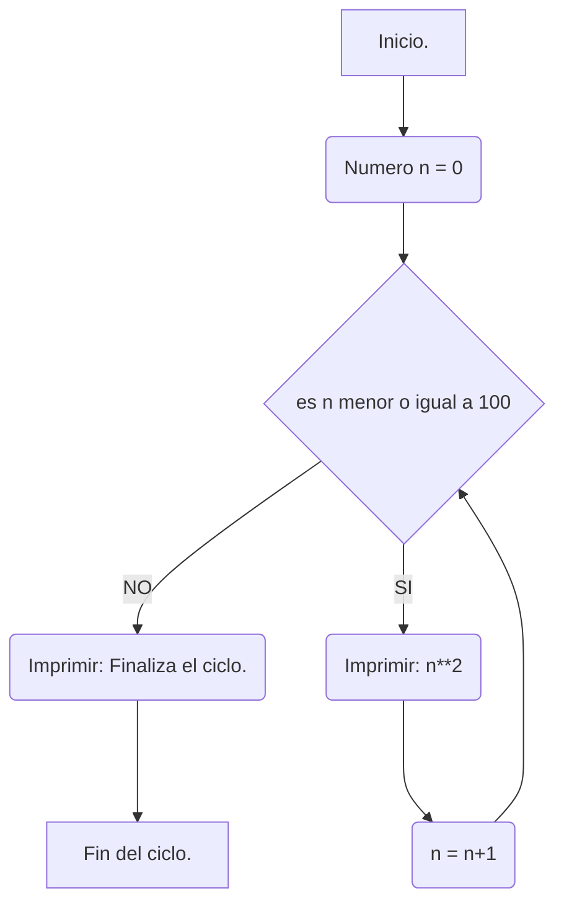
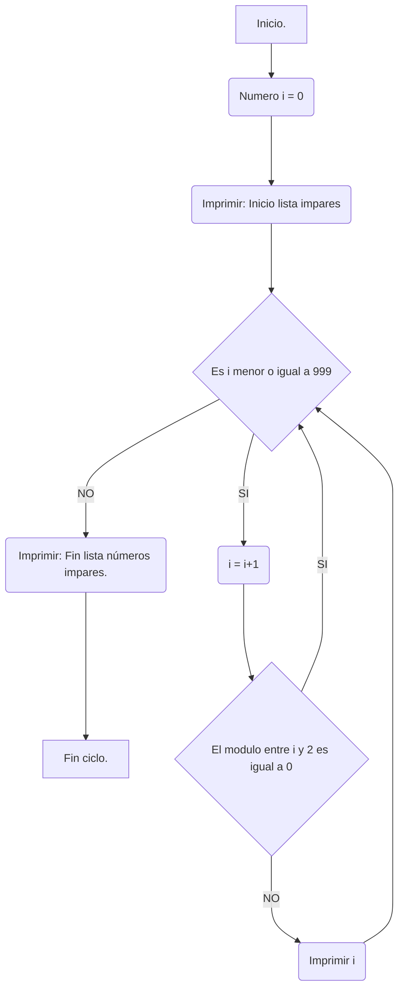
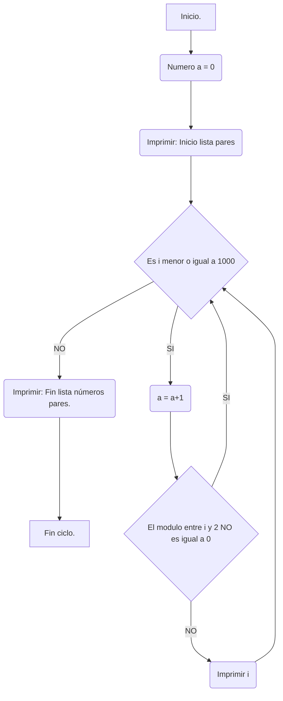
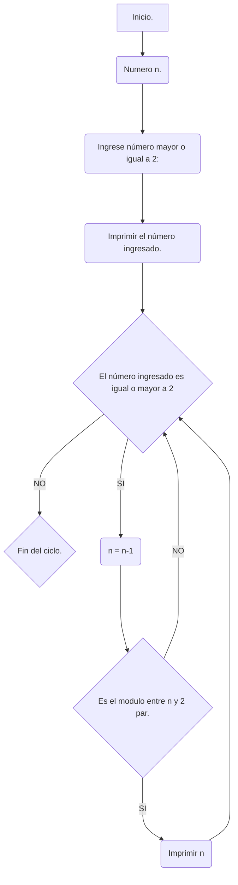

# Repositorio reto 7. 
### _Desarrollado por Ana Maria De Felipe Briñez._
---
Bienvenidos a uno de los retos más sufridos por su programadora favorita. 

En este repositorio nos adentraremos al mundo de los bucles y resolveremos los problemas propuestos en la clase. 

Para comenzar, adjuntare el pantallazo de una parte de los ejercicios planteados en clase. (Pd: Revisar el archivo para más comodidad). 


---

Ahora bien, una vez ya revisado los ejercicios, me dirigiré directamente a los puntos del reto. (Pd: Revisar el archivo para más comodidad).

Para comenzar observamos el primer punto. 

1. Imprimir un listado con los números del 1 al 100 cada uno con su respectivo cuadrado.

Para ello desarrolle el siguiente código con su respectivo diagrama de flujo. 

```Python
numero1:int = 0 # Inicia.
while (numero1 <= 100):  # Condición: mientras que a, sea menor o igual que 100.
    print("El cuadrado del número", numero1, "es", numero1**2) # Imprime El valor de a, al cuadrado.
    numero1 +=1  # Actualiza. 
print("El valor con el que se termina el ciclo es " + str(numero1)) # Finaliza el ciclo. 
```
 `Diagrama de flujo de números del 1 al 100 elevados al cuadrado.` 


---

Continuamos con el siguiente punto. 

2. Imprimir un listado con los números impares desde 1 hasta 999 y seguidamente otro listado con los números pares desde 2 hasta 1000.}

Desarrolle el siguiente código para la solución de dicho punto, conjunto a su diagrama de flujo. 

```Python
i: int = 0 # Inicio
print("Inicio lista impares")  # Imprime comentario antes de iniciar el ciclo.
while (i <=999): # Condición: Números menores o iguales a 999.
  i+=1 # Actualiza: "i" sumandole 1. 
  if i%2 == 0: # Nueva condición: Si el modulo "i" entre 2 es igual a 0. 
    continue # Si cumple la conción anteriormente dada, ignora el valor y continua con el siguiente número en la condición principal. 
  print(i) # Imprime valores dados dentro del ciclo. 
print("Fin lista impares") # Fin del ciclo: Imprime comentario indicando el fin de la lista de los número impares.

a: int = 0 #Inicio
print("Inicio lista pares")  # Imprime comentario antes de iniciar el ciclo. 
while (a <=1000): # Condición: Números menores o iguales a 1000.
  a +=1 #Actualiza "a" sumandole 1. 
  if not(a%2==0): # Nueva condición: Si el modulo "a" entre 2 NO es igual a 0. 
    continue # Si cumple la conción anteriormente dada, ignora el valor y continua con el siguiente número en la condición principal. 
  print(a) # Imprime valores dados dentro del ciclo. 
print("Fin lista pares") #Fin del ciclo: Imprime comentario indicando el fin de la lista de los número pares.
```

 `Diagrama de flujo de números impares del 1 al 999.` 

  `Diagrama de flujo de números pares del 1 al 1000.` 


--- 
Avanzando, nos encontramos con el siguiente punto. 

3. Imprimir los números pares en forma descendente hasta 2 que son menores o iguales a un número natural n ≥ 2 dado. 

Para ello, desarrolle el siguiente código y, además, su diagra de flujo. 

```Python
n : int = int(input("Ingrese un número mayor o igual a 2: ")) # Inicia. Pide ingresar un número. 
print("El número ingresado fue: " + str(n)) # Imprime el comentario antes de iniciar el ciclo
while (n>=2): # Condición: Que n sea mayor a 2. 
    n -=1 # Actualiza: Resta 1 a n
    if n%2==0: # Nueva condición: Si n el modulo de n entre 2 es igual a 0. 
        print(n) # Si se cumple la condición anteriormente dada, imprime a n y reevalúa el código. 
```

  `Diagrama de flujo: Lista descendente de números pares.` 


---

Ahora bien, observamos el siguiente punto. 

4. En 2022 el país A tendrá una población de 25 millones de habitantes y el país B de 18:9 millones. Las tasas de crecimiento anual de la población serán de 2% y 3% respectivamente. Desarrollar un algoritmo para informar en que año la población del país B superará a la de A.

Para ello desarrolle el siguiente código.

```Python
A: float = 25 # Inicia con la primer variable: Población del país A en millones 
B: float = 18.9  # Nombra segunda variable: Población del país B en millones.
añosQuePasan: int=2022 # Nombra tercer varible: Años que pasan. 

while (A>=B): # Condición: Que el "paisA" sea mayor al "pais B"
    A = A + (A*0.02)  # Actualiza: Opera el 2 porciento de la población de A y se lo suma a A. 
    B = B + (B*0.03) # Actualiza: Opera el 3 porciento de la población de B y se lo suma a B. 
    añosQuePasan +=1 # Actualiza: Suma un año más. 
```
---

Continuamos con el siguiente punto. 
5. Imprimir el factorial de un número natural n dado.

Desarrolle el siguiente código para la solución de dicho punto. 

```Python
n: int = int(input("Ingrese un número natural: ")) # Inicia: Pide ingresar un número. 
valorIncialn: int = n  # Nombra la segunda variable: Esta va tomar el valor de original de n
while (n>0): # Condición: Que n sea mayor a 0. 
    n -=1 # Actualiza: Resta 1 a n. 
    valorIncialn= valorIncialn*n # Actualiza: Multiplica el nuevo valor de n.
    if n==0: # Da una condición: Si "n" es igual a 0. 
        break # Ocasiona que si se cumple la condición anterior termina el ciclo. 
    if n == 1: # Da una condición: Si "n" es igual a 1. 
        print("El factorial es", valorIncialn)  # Si cumple la condición anterior imprime el cometario. 
```
--- 
Avanzando, nos encontramos con el siguiente punto.  

6. Implementar un algoritmo que permita adivinar un número dado de 1 a 100, preguntando en cada caso si el número es mayor, menor o igual.

Para ello, desarrolle los siguientes códigos.

```Python
# El programa adivina un número dado por el usuario.
 
n: int = int(input("Ingrese número entero a adivinar: ")) # Inicia: Pide ingresar un número. 
base = 0 # Nombra una segunda varible: En este caso será la base que el programa irá modificando hasta adivinar el número dado.  
while not(base==n) and 1<=n<=100: # Condición: Que base no sea igual a n y que este en el rango de 1 a 100. 
    if n>base: # Nueva condición: Si n es mayor que la base. 
        base +=1 # Si se cumple la condición suma 1 a la base y reevalúa el codigo. 
    if n<base: # Nueva condición: Si n es menor que la base. 
        base -=1  # Si se cumple la condición resta 1 a la base. 
print("El número puesto fue: " + str(base)) # Finaliza ciclo: Imprime comentario cuando hay un valor que no cumpla la condición. 
```

```Python
# El usuario adivina un aleatorio número dado por el programa. 

import random  # Llama a la función aleatoria. 
n = random.randint(1, 100)   # Inicio: El programa soltará un número aleatorio. 
print("El número aleatorio fue: " + str(n)) # Imprime comentario antes de comenzar el ciclo. 
base: int = int(input("Ingrese número de 1 a 100 que considera es el número que tiene el programa: ")) #Segunda variable: pide al usuario ingresar un número. 

while (1<=base<=100): # Condición: Que la base este entre 1 y 100. 
    if n==base: # Nueva condicíon: Si la base es igual a n. 
        print("Adivinaste el número") # Imprime el comentario si se cumple la condición dada anteriormente. 
        break # Interrumple y termina el ciclo si se cumple la condición. 
    if base>n: # Nueva condicíon: Si la base es mayor a n.  
        base = int(input("El número es MENOR, inserte un nuevo número: ")) # Imprime el comentario si se cumple la condición dada anteriormente, pidiendo al usuario ingresar un nuevo valor y reevalúa. 
    if base<n: # Nueva condicíon: Si la base es menor a n.  
        base = int(input("El número es MAYOR, inserte un número nuevo: ")) # Imprime el comentario si se cumple la condición dada anteriormente, pidiendo al usuario ingresar un nuevo valor y reevalúa.  
print("El número que ingresaste fue: " + str(base)) # Final del ciclo. Imprime cuando el ciclo se termina. 
```

---
Ahora bien, observamos el siguiente punto. 

7. Implementar un programa que ingrese un número de 2 a 50 y muestre sus divisores.

Para ello desarrolle el siguiente código.

```Python
n: int = int(input("Ingrese un número entre 2 y 50: ")) # Inicia: Pide al usuario un valor. 
divisorDen: int = 1 # Segunda variable: divisores de "n". 
while (2<=n<=50) and divisorDen<=n: # Condición: que "n" este entre 2 y 50 y que la segunda variable sea menor a "n". 
    if n%divisorDen == 0: # Nueva condión: Que el modulo de "n" entre "divisorDen" sea igual a 0. 
        print ("El número", divisorDen, "es un divisor de", n) # Si se cumple, imprime el cometario. 
    divisorDen +=1 # Actualiza: Suma 1 y reevalúa. 
```
---

Continuamos con el siguiente punto. 

8. Implementar el algoritmo que muestre los números primos del 1 al 100. nota: use funciones

Desarrolle el siguiente código para la solución de dicho punto. 

```Python
def numerosprimos (n:int):  #Nombra la función. 
    # <Instrucciones de la función.>
    n= 1 # Iniciamos el while. 
    while 1<=n<=100: # Condición: Que n este entre 1 y 100. 
        totalDeCeros = 0 # Nombra variable dentro del while. (Para lograr volverlas a su estado original si lo deseamos.)
        divisor = 1 # Nombra variable dentro del while. (Para lograr volverlas a su estado original si lo deseamos.)
        while divisor<=n: # Genera un nuevo while, con instrucciones propias: Que la variable "divisor", sea menor o igual a "n"
            if n%divisor == 0:  # Nueva condición: Si el modulo de "n" entre "divisor" es igual a 0. 
                totalDeCeros +=1 # Si se cumple la condición anteriormente dada, suma 1. 
            divisor +=1 # Actualiza (solo dentro del nuevo while): Aumenta uno al divisor, si cumple el while. 
        # <Finaliza while secundario>
        if totalDeCeros==2: # Nueva condición: Si el "totalDeCeros" es igual a 2. 
            print(n) # Si cumple la condición anterior, imprime n. 
        n +=1 # Actualiza (en el while principal): Suma 1 a "n". 
    # <Finaliza función y while> 

if __name__ == "__main__": # Llama a la función principal. 
    númerosprimos = numerosprimos(n) # Nombra variable: Con las instrucciones y resultados de la función "numerosprimos"
    print (númerosprimos) # Imprime el resultado de la función. 
```
--- 
Eso fue todo por este repositorio, si te gusto, no olvides dar tu estrella. 
